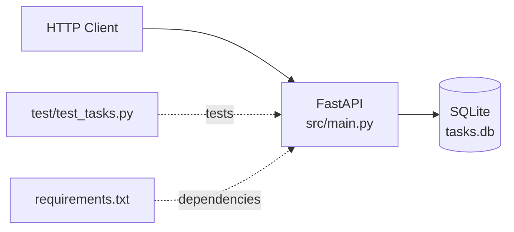

# Task Manager API

A simple REST API for managing tasks, built with FastAPI.

> **Note:** Despite the repository name `python-flask-main`, this project uses **FastAPI**, not Flask.

## Features

- Create, read, update, and delete tasks
- Mark tasks as complete
- Filter tasks by completion status
- SQLite database for persistence

## Known Issues (Educational)

This project intentionally contains several bugs and code smells for learning purposes:

1. **SQL Injection Vulnerability** - Delete endpoint is vulnerable
2. **Memory Leaks** - Database connections not properly closed
3. **Missing Validation** - Can create tasks with empty titles
4. **Missing Error Handling** - No 404 handling for non-existent tasks
5. **Code Duplication** - CRUD patterns repeated across endpoints
6. **Hard-coded Configuration** - Database path and port hard-coded
7. **Failing Tests** - Missing test fixtures

## Setup

```bash
# Install dependencies
pip install -r requirements.txt

# Run the API
python src/main.py

# Run tests
pytest test/
```

## API Endpoints

- `GET /` - Health check
- `GET /tasks` - List all tasks
- `GET /tasks/{id}` - Get specific task
- `POST /tasks` - Create new task
- `PUT /tasks/{id}` - Update task
- `DELETE /tasks/{id}` - Delete task
- `POST /tasks/{id}/complete` - Mark task complete

## Real-World Workflow Examples

This project is designed for testing Claude Code + MCP workflows:

### Bug Fix Workflow
```
"Find and fix the SQL injection vulnerability in the delete endpoint"
```

### Refactoring Workflow
```
"Extract the duplicate database query patterns into helper functions"
```

### Feature Addition Workflow
```
"Add a priority field to tasks with validation (low, medium, high)"
```

### Test Fix Workflow
```
"Fix the failing tests by adding the missing pytest fixture"
```

### Full Linear Integration Workflow
```
"Create Linear issues for each bug, then fix them one by one and update Linear as you go"
```

## Architecture



## Database Schema

```sql
CREATE TABLE tasks (
    id INTEGER PRIMARY KEY AUTOINCREMENT,
    title TEXT NOT NULL,
    description TEXT,
    completed BOOLEAN DEFAULT 0,
    created_at TIMESTAMP DEFAULT CURRENT_TIMESTAMP
)
```
