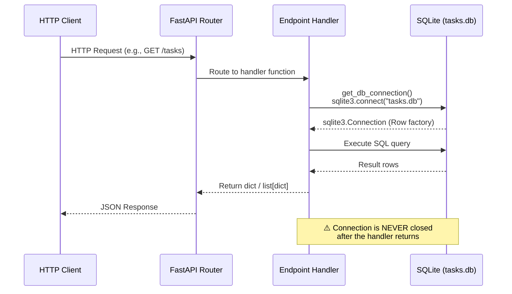

# Architecture Overview

> **Project:** Task Manager API — A FastAPI sandbox for AI-assisted development workflow testing.
>
> **Source layout:** Single-file application (`src/main.py`, 181 lines) with a companion test suite (`test/test_tasks.py`, 128 lines).

---

## Table of Contents

1. [Project Purpose](#project-purpose)
2. [System Design](#system-design)
3. [Request Flow](#request-flow)
4. [API Endpoints](#api-endpoints)
5. [Database Schema](#database-schema)
6. [Connection & Initialization Pattern](#connection--initialization-pattern)
7. [Test Suite](#test-suite)
8. [Known Architectural Limitations](#known-architectural-limitations)
9. [File Map](#file-map)

---

## Project Purpose

This repository is a **deliberately flawed** FastAPI application designed as a sandbox for testing AI-assisted development workflows. It implements a minimal task-management CRUD API while embedding **intentional bugs and anti-patterns** that serve as targets for automated code review, refactoring, and documentation tools.

The codebase is **not intended for production use**. Its value lies in providing a realistic, small-scale project with known defects that AI agents can detect, document, and fix.

---

## System Design

The application follows a **single-file monolith** pattern. All application logic — routing, database access, initialization, and configuration — lives in `src/main.py`.

```
python-flask-main/
├── src/
│   └── main.py            # All application logic (181 lines)
├── test/
│   └── test_tasks.py      # Pytest test suite (128 lines)
├── docs/                   # Documentation (this directory)
│   ├── architecture/
│   ├── guides/
│   └── api/
├── requirements.txt        # Python dependencies
└── README.md
```

### Key Design Characteristics

| Characteristic | Detail |
|---|---|
| **Framework** | FastAPI (imported on line 11) |
| **Database** | SQLite via Python's built-in `sqlite3` module |
| **App instance** | `app = FastAPI(title="Task Manager API")` (line 16) |
| **Entry point** | `uvicorn.run(app, host="0.0.0.0", port=8000)` (lines 178–181) |
| **Architecture** | No service layer, no repository pattern — handlers query the DB directly |

---

## Request Flow

Every request follows the same linear path through the application. There is no middleware, no dependency injection, and no service layer.



### Detailed Flow

1. **Client** sends an HTTP request to one of the 7 endpoints.
2. **FastAPI router** matches the path and HTTP method to a handler function (e.g., `list_tasks`, `create_task`).
3. **Handler** calls `get_db_connection()` (line 22) which returns a `sqlite3.Connection` with `row_factory = sqlite3.Row`.
4. **Handler** executes raw SQL against the connection.
5. **Handler** converts `sqlite3.Row` objects to `dict` via `dict(row)` and returns them.
6. **FastAPI** serializes the return value to JSON and sends the HTTP response.
7. **Connection is leaked** — no handler closes its database connection.

---

## API Endpoints

The application exposes 7 endpoints, all defined in `src/main.py`:

| Method | Path | Handler | Line | Description |
|---|---|---|---|---|
| `GET` | `/` | `root()` | 50 | Health check — returns `{message, version}` |
| `GET` | `/tasks` | `list_tasks(completed)` | 55 | List tasks, optional `completed` filter (query param) |
| `GET` | `/tasks/{task_id}` | `get_task(task_id)` | 72 | Get single task by ID — **no 404 handling** |
| `POST` | `/tasks` | `create_task(title, description)` | 85 | Create task — params via query string, **no validation** |
| `PUT` | `/tasks/{task_id}` | `update_task(task_id, ...)` | 108 | Update task fields — raises 400 if no fields given |
| `DELETE` | `/tasks/{task_id}` | `delete_task(task_id)` | 143 | Delete task — **SQL injection vulnerability** |
| `POST` | `/tasks/{task_id}/complete` | `complete_task(task_id)` | 161 | Mark task completed — **no 404 handling** |

### Input Handling

All endpoints accept parameters via **query strings** (not JSON request bodies). For example, creating a task:

```
POST /tasks?title=My+Task&description=Details+here
```

The `update_task` endpoint dynamically builds a SQL `UPDATE` statement from whichever query parameters are provided (`title`, `description`, `completed`).

---

## Database Schema

The application uses a single SQLite database file (`tasks.db`) with one table. The schema is defined in the `init_db()` function (lines 29–42):

```sql
CREATE TABLE IF NOT EXISTS tasks (
    id          INTEGER PRIMARY KEY AUTOINCREMENT,
    title       TEXT NOT NULL,
    description TEXT,
    completed   BOOLEAN DEFAULT 0,
    created_at  TIMESTAMP DEFAULT CURRENT_TIMESTAMP
);
```

### Column Details

| Column | Type | Constraints | Description |
|---|---|---|---|
| `id` | `INTEGER` | `PRIMARY KEY AUTOINCREMENT` | Auto-incrementing unique identifier |
| `title` | `TEXT` | `NOT NULL` | Task title (no app-level empty-string validation) |
| `description` | `TEXT` | *(nullable)* | Optional task description |
| `completed` | `BOOLEAN` | `DEFAULT 0` | Completion flag (`0` = incomplete, `1` = complete) |
| `created_at` | `TIMESTAMP` | `DEFAULT CURRENT_TIMESTAMP` | Auto-set on insert |

> **Note:** SQLite does not enforce `BOOLEAN` or `TIMESTAMP` as distinct types — these are stored as `INTEGER` and `TEXT` respectively under SQLite's type affinity rules.

---

## Connection & Initialization Pattern

### Database Connection — `get_db_connection()` (lines 22–26)

```python
def get_db_connection():
    conn = sqlite3.connect(DATABASE_PATH)
    conn.row_factory = sqlite3.Row
    return conn
```

- Creates a **new connection** on every call.
- Sets `row_factory = sqlite3.Row` so query results can be accessed by column name.
- The connection is **never closed** by any caller — this is the root cause of memory leaks across all endpoints.

### Database Initialization — `init_db()` (lines 29–42)

```python
def init_db():
    conn = get_db_connection()
    conn.execute("""CREATE TABLE IF NOT EXISTS tasks (...)""")
    conn.commit()
    # BUG: Connection never closed - memory leak!
```

- Called once via the FastAPI `startup` event (lines 45–47).
- Uses `CREATE TABLE IF NOT EXISTS` so it is safe for repeated invocations.
- The connection opened here is **also never closed**.

### Startup Hook (lines 45–47)

```python
@app.on_event("startup")
async def startup():
    init_db()
```

The `@app.on_event("startup")` decorator ensures the database and table exist before any request is served.

---

## Test Suite

The test suite lives in `test/test_tasks.py` (128 lines) and uses `pytest` with FastAPI's `TestClient`.

### Critical Issue: Commented-Out Fixture

```python
# BUG: Missing fixture - tests will fail
# @pytest.fixture
# def client():
#     return TestClient(app)
```

Lines 22–24: The `client` fixture is **commented out**, which means every test function that declares `client` as a parameter will fail with a `fixture 'client' not found` error. **All 9 test functions depend on this fixture.**

### Test Inventory

| Test Function | Line | Tests |
|---|---|---|
| `test_root` | 27 | `GET /` returns 200 with `message` key |
| `test_create_task` | 34 | `POST /tasks` creates and returns task |
| `test_create_empty_task` | 47 | Empty title should return 400 (**will fail — no validation**) |
| `test_list_tasks` | 56 | `GET /tasks` returns non-empty list |
| `test_get_nonexistent_task` | 67 | Non-existent ID should return 404 (**will fail — no 404 handling**) |
| `test_update_task` | 76 | `PUT /tasks/{id}` updates fields |
| `test_delete_task` | 93 | `DELETE /tasks/{id}` removes task |
| `test_complete_task` | 108 | `POST /tasks/{id}/complete` sets `completed=1` |
| `test_sql_injection_protection` | 122 | Placeholder — `pass` only |

---

## Known Architectural Limitations

The application contains **7 intentional architectural issues**. These are documented as learning targets for AI-assisted development workflows.

### 1. 🔴 SQL Injection Vulnerability (Line 153)

**Severity:** Critical
**Location:** `delete_task()` — `src/main.py`, line 153

```python
query = f"DELETE FROM tasks WHERE id = {task_id}"
```

The `task_id` value is interpolated directly into the SQL string using an f-string. Although FastAPI's path parameter typing (`task_id: int`) provides partial protection by rejecting non-integer inputs at the routing layer, the pattern itself is dangerous and should use parameterized queries:

```python
# Safe alternative:
conn.execute("DELETE FROM tasks WHERE id = ?", (task_id,))
```

Every other endpoint in the application correctly uses parameterized queries (`?` placeholders). This inconsistency makes the vulnerability especially easy to miss in code review.

---

### 2. 🟠 Memory Leaks — Unclosed Database Connections (7 locations)

**Severity:** High
**Locations in `src/main.py`:**

| Function | Line with leaked connection |
|---|---|
| `init_db()` | 42 |
| `list_tasks()` | 68 |
| `get_task()` | 81 |
| `create_task()` | 104 |
| `update_task()` | 139 |
| `delete_task()` | 157 |
| `complete_task()` | 174 |

Every function that calls `get_db_connection()` opens a new `sqlite3.Connection` but **never calls `conn.close()`**. Over time, this accumulates file descriptors and memory. The idiomatic fix is to use a context manager:

```python
with sqlite3.connect(DATABASE_PATH) as conn:
    conn.row_factory = sqlite3.Row
    # ... use connection ...
# Connection automatically closed
```

---

### 3. 🟡 Missing Input Validation — Empty Titles Accepted (Line 86)

**Severity:** Medium
**Location:** `create_task()` — `src/main.py`, line 86

```python
async def create_task(title: str, description: str = ""):
```

The `title` parameter is typed as `str` but there is no check for empty strings. A request like `POST /tasks?title=` will successfully create a task with an empty title. While the database schema includes `NOT NULL` on the `title` column, SQLite treats an empty string `""` as a valid non-null value.

The test `test_create_empty_task` (test file line 47) expects a 400 response for empty titles and will **fail** because this validation does not exist.

---

### 4. 🟡 Missing 404 Error Handling (Lines 80, 173)

**Severity:** Medium
**Locations:**
- `get_task()` — line 80: `dict(task)` will raise `TypeError` if `task` is `None`
- `complete_task()` — line 174: same issue, `dict(task)` on a potentially `None` result

When a non-existent `task_id` is requested, the `fetchone()` call returns `None`. The handler then calls `dict(None)`, which raises an unhandled `TypeError` resulting in a 500 Internal Server Error instead of a proper 404.

The test `test_get_nonexistent_task` (test file line 67) expects a 404 response and will **fail** because of this missing handling.

The `delete_task()` and `update_task()` endpoints have the same conceptual problem — they silently succeed even when the target task does not exist — but they do not crash because they do not attempt to convert `None` to `dict`.

---

### 5. 🟡 Code Duplication Across Endpoints

**Severity:** Medium
**Locations:** Throughout `src/main.py`

Several patterns are repeated verbatim across multiple endpoints:

| Duplicated Pattern | Occurrences |
|---|---|
| `conn = get_db_connection()` | 7 times (every handler + `init_db`) |
| `conn.execute("SELECT * FROM tasks WHERE id = ?", (task_id,)).fetchone()` | 4 times (lines 78, 102, 137, 171) |
| `dict(task)` / `[dict(task) for task in tasks]` | 6 times |
| Missing `conn.close()` | 7 times |

This violates the DRY (Don't Repeat Yourself) principle and makes maintenance error-prone. A repository or service layer would centralize data access logic.

---

### 6. 🟡 Hard-Coded Configuration (Lines 19, 178–181)

**Severity:** Medium
**Locations:**
- Line 19: `DATABASE_PATH = "tasks.db"` — database file path
- Line 180–181: `uvicorn.run(app, host="0.0.0.0", port=8000)` — host and port

Configuration values are embedded directly in source code. There is no support for environment variables, `.env` files, or configuration profiles. This makes it impossible to change settings (e.g., database location, port) without modifying source code.

Idiomatic alternatives include:
- `os.environ.get("DATABASE_PATH", "tasks.db")`
- Pydantic `BaseSettings` for type-safe config with `.env` support
- Command-line arguments via `argparse` or `typer`

---

### 7. 🟡 Failing Test Suite — Commented-Out Fixture (Lines 22–24)

**Severity:** Medium
**Location:** `test/test_tasks.py`, lines 22–24

```python
# @pytest.fixture
# def client():
#     return TestClient(app)
```

The `client` pytest fixture is commented out. Since all 9 test functions accept `client` as a parameter, pytest cannot resolve the fixture and **every test fails** with:

```
ERRORS - fixture 'client' not found
```

Additionally, even if the fixture were restored:
- `test_create_empty_task` would fail (no input validation — limitation #3)
- `test_get_nonexistent_task` would fail (no 404 handling — limitation #4)
- `test_delete_task` would fail (expects 404 on subsequent GET — limitation #4)
- `test_sql_injection_protection` is a no-op (`pass` — no assertions)

---

## File Map

| File | Purpose | Lines |
|---|---|---|
| `src/main.py` | Complete application — FastAPI app, routes, DB access | 181 |
| `test/test_tasks.py` | Pytest test suite (non-functional due to missing fixture) | 128 |
| `requirements.txt` | Python dependencies | — |
| `README.md` | Project readme | — |
| `docs/architecture/overview.md` | This document | — |
| `docs/guides/` | *(placeholder)* Getting-started and testing guides | — |
| `docs/api/` | *(placeholder)* API reference documentation | — |

---

*Document generated from source code analysis of `src/main.py` (181 lines) and `test/test_tasks.py` (128 lines). All line numbers verified against current source.*
